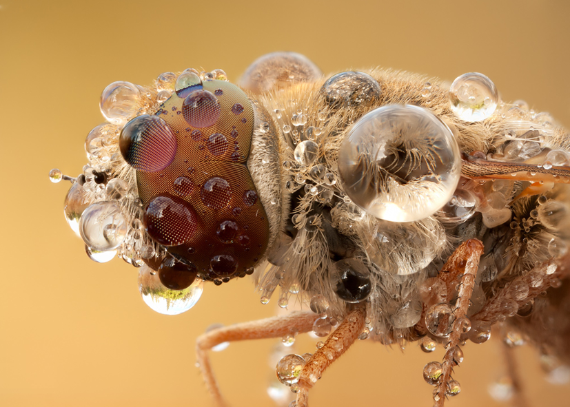

Parallell-Blur
==============

A parallell box blur program made for efficient CPU blurring.

It is implemented using the Pthreads library in C. 
For image reading, Quick n' Dirty BMP library was used, which can be found [here](http://qdbmp.sourceforge.net).

## Optimizations

The program uses two one-dimensional blurs, one vertical and one horizontal.

The method of using two one-dimensional blurs does come with a flaw, namely its
cache utilization efficiency. An image stored in row-major order will use the cache
efficiently in the horizontal algorithm, but will suffer a large perfomance loss in the
vertical algorithm. Tests performed on the two algorithms show that the horizontal
algorithm completes its execution about 3-4 times faster than the vertical one.
To address this, the vertical blur algorithm was slightly altered to make it traverse
the image row wise rather than column wise. Each column in the image is assigned a
sum in an array. For each pixel in a row, that pixel will be altered according to the
accumulated sum in the array position corresponding to the current pixel’s column

## Usage

To use the program, run make in the source program to compile. The program requires
some input to run properly. A typical execution of the program could look like this:
./blurpt lena.bmp -o blurrylena.bmp -r 10 -t
Here, lena.bmp is the input file, -o blurrylena.bmp is the output file, -r 10 denotes
that the radius of the blur should be 10 pixels and -t gives time outputs for speed
measuring. The program only works with .bmp image files.

## Example

